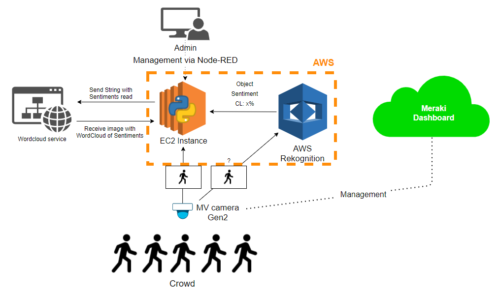
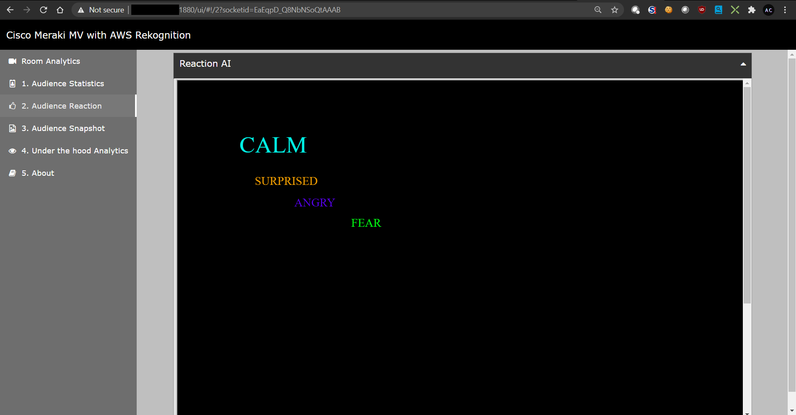

# Meraki-Computer-Vision-2
This is a follow up to this project https://github.com/amcamillo/Meraki-Computer-Vision.
> To learn more about how to set this up, read this article: https://medium.com/swlh/how-to-setup-and-deploy-aws-face-recognition-on-meraki-mv-cameras-b289ba3dae2c

_____________________________________________________________________________________________
Major Credits go to the original Project : https://github.com/andersm9/Meraki-Computer-Vision

_____________________________________________________________________________________________

This is the Version 2 of my additions to the Original Project.
I've improved the code adding a few more capabilities including:

> Frontend

- Added more tabs to Node-red, highlighting "Audience Analytics" with:
- Audience Age estimatives
- Audience Reaction in a Wordcloud
- Added "About" tab in frontend to highlight Who is demoing
- Authentication to Node-red Admin and UI

> Backend

- Integration with 3rd party service for the wordcloud creation
- Basic algorithm to count reactions and send them to wordcloud

## Architecture
This is what the architecture looks like in this new iteration:

## User Interface
And this is what the Reaction Wordcloud looks like:

## Demonstration
Here's a quick video showcasing what this code can do:
https://youtu.be/-aqLg6v3ePc

